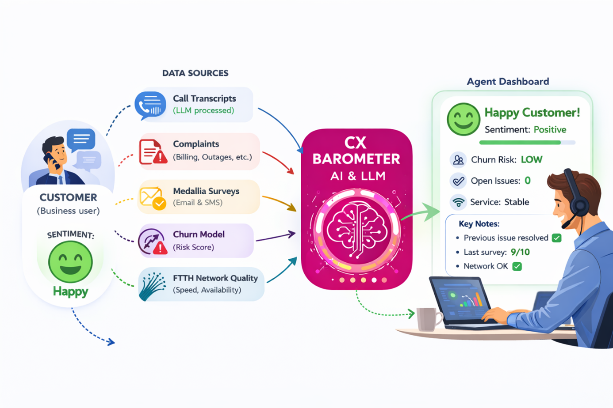
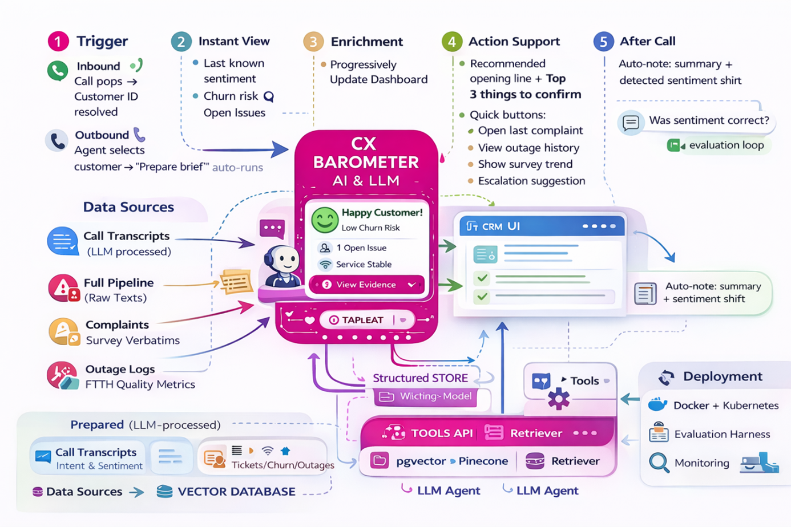

# CX Barometer – Agentic RAG System

AI-powered sentiment and risk intelligence assistant for B2B call center agents.

🧩 1. Problem + Audience
What problem are you trying to solve? Why is this a problem?
Customer service agents in a B2B call center environment must quickly understand the full context of a customer before and during an interaction.
When a customer calls — or when an agent initiates outbound contact — the agent must manually gather information from multiple disconnected systems, including:
•	Previous call transcripts (already processed by an LLM system)
•	Complaints (billing issues, service availability, disputes, etc.)
•	Reported service disruptions
•	Customer satisfaction survey results (from Medallia – email/SMS feedback)
•	Churn prediction model outputs (likelihood of customer leaving)
•	FTTH network quality measurement systems (speed, optical network availability, buildout status)
This creates several operational problems:
•	Context is fragmented across tools
•	Agents must switch between systems during live calls
•	Critical risk signals (e.g., high churn probability + negative survey feedback) may be missed
•	There is no unified sentiment or risk indicator
•	Response quality depends heavily on individual agent effort
Most importantly, agents lack a real-time, consolidated sentiment signal that reflects the customer's overall experience and risk level at the moment of interaction.
Without this insight, conversations begin reactively instead of strategically.
________________________________________
What is your proposed solution? Why is this the best solution?
The proposed solution is CX Barometer — an AI-powered aggregation and sentiment intelligence system that consolidates customer data into a single, real-time interaction readiness view.
The system would:
1.	Aggregate data from:
o	LLM-processed call transcripts
o	Complaint management systems
o	Service disruption records
o	Medallia customer satisfaction surveys
o	Churn prediction models
o	FTTH network quality measurement systems
2.	Apply:
o	Cross-source signal fusion
o	Sentiment analysis
o	Risk scoring
o	Context summarization
3.	Present to the agent:
o	A clear sentiment indicator (green / yellow / red or emoji-based visualization)
o	A churn risk flag
o	Key contextual highlights
o	Status of open issues
The goal is to provide an instant (real time), cognitively light, actionable customer overview before or at the start of any interaction.
This is the best solution because it:
•	Reduces cognitive load
•	Eliminates manual cross-system checks
•	Surfaces hidden risk patterns
•	Enables proactive communication strategy
•	Standardizes interaction quality
•	Improves both customer satisfaction and retention
Instead of reacting to problems during the call, agents begin each conversation informed, prepared, and strategically aligned.
________________________________________
Who is the audience that has this problem and would use your solution?
The primary audience is:
•	B2B call center agents
•	Business customer support representatives
•	Account management support teams
These employees manage high-value business clients where service continuity, trust, and responsiveness are critical.
When this problem is discussed with them, they immediately recognize it. They often express frustration about:
•	Checking multiple systems during a live call
•	Not knowing customer mood upfront
•	Discovering churn risk too late
•	Missing context that could have changed the tone of the conversation
They clearly resonate with a solution that provides:
•	Instant context
•	Visible sentiment
•	Clear risk awareness
•	Faster preparation
•	More confident communication
In short: yes — they nod their heads when the problem is described. 

# CX Barometer

💡 2. Solution — Proposed system + UX flow (1–2 paragraphs)

CX Barometer is an agentic, retrieval-augmented system embedded into the B2B call-center workspace. At the moment an inbound call arrives (or before an outbound call starts), the agent automatically assembles a customer “interaction brief” by pulling signals from multiple internal systems (LLM-processed call transcripts, complaints, outages, Medallia surveys, churn risk, FTTH quality metrics). The system then generates a single, consistent view: a sentiment indicator (green/yellow/red + emoji), churn risk, open-issue status, and a short list of “what to address first” talking points. The goal is to reduce tool switching and give agents instant situational awareness while they stay focused on the conversation.
From a user experience perspective, the agent sees a compact CX Barometer card inside the CRM/call-center UI:
  -  sentiment + risk at-a-glance, 
-  5–8 bullet highlights (“why this sentiment/risk”) 
-  expandable evidence with source links (“show me the call summary”, “show last Medallia rating”, “show outages in last 7 days”). 
Under the hood, an orchestrated LLM agent decides which tools to call, retrieves relevant customer context from a vector database + structured stores, and produces grounded outputs with citations to internal sources—so the agent can trust why the barometer is red/green.

 

UX flow (agent journey)
1.	Trigger
o	Inbound: call pops → customer ID resolved
o	Outbound: agent selects customer → “Prepare brief” auto-runs
2.	Instant view (0–2s target)
o	Show last known sentiment + churn risk + open issues (cached / precomputed if available)
3.	Enrichment (2–10s target)
o	Agentic workflow pulls fresh signals (tickets, outages, FTTH KPIs, last survey)
o	Updates barometer + highlights progressively
4.	Action support
o	“Recommended opening line” + “Top 3 things to confirm”
o	Quick buttons: Open last complaint, View outage history, Show survey trend, Escalation suggestion
5.	After-call
o	Auto-note: summary + detected sentiment shift
o	Feedback button: “Was sentiment correct?” (for evaluation loop)

 

Handling multiple data sources (raw vs prepared)
A) Prepared sources (already LLM-processed)
•	Example: call transcripts already summarized/extracted (intent, outcome, sentiment)
•	We store structured outputs + embeddings; retrieval is fast and low-cost.
B) Raw sources (need full pipeline)
•	Example: complaints text, outage logs, FTTH measurements, survey verbatims
•	Pipeline: normalize → extract key fields → embed text chunks → index → optionally create per-customer rolling summaries.
C) Fusion layer (the key part)
•	Combine structured signals (KPIs, churn score, open tickets) + retrieved textual evidence (complaint snippets, survey verbatims)
•	Produce a unified Sentiment + Risk explanation.
 
Tooling choices (one sentence each)
•	LLM(s): GPT-4.1 / GPT-4o (or enterprise equivalent) — strong instruction-following and summarization quality for agent briefs and grounded explanations.
•	Agent orchestration framework: LangGraph (or equivalent) — explicit state machine + controllable multi-step tool calling is ideal for enterprise workflows and reliability.
•	Tools layer: internal connectors (REST/SQL) + function calling — clean separation between business logic and data access; easy to audit.
•	Embedding model: text-embedding-3-large (or enterprise embedding) — robust semantic retrieval across mixed customer-support texts.
•	Vector DB: pgvector / Pinecone / Weaviate — vector search for complaint/survey/transcript snippets; pgvector is simplest if you already use Postgres.
•	Structured store: Postgres + warehouse (optional) — churn scores, outage counts, ticket states, FTTH KPIs are best queried as structured data.
•	Monitoring tool: LangSmith / OpenTelemetry — trace every agent step and tool call for debugging and governance.
•	Evaluation framework: Ragas + custom metrics — baseline RAG quality (context precision/recall) plus task success scoring (“sentiment correct?”).
•	User interface: CRM embedded panel (web widget) — meets agents where they work; minimal workflow disruption.
•	Deployment: Docker + Kubernetes (or internal platform) — repeatable deployments, secure network access to internal systems.

# CX Barometer- UX flow

🔐 3. Data + Keys — Data source + API access working
Likely user questions (what agents will ask)
Agents will typically want fast answers to questions like:
•	“What’s the current customer sentiment and why?”
•	“What happened in the last 3 interactions/calls?”
•	“Are there open complaints, outages, or unresolved issues?”
•	“Is the customer at risk of churn? What signals support that?”
•	“Any recent negative events affecting service quality (FTTH speed/availability)?”
•	“Has anything changed recently that could impact this customer today?”
•	“Is there any public information (news, announcements) that could explain the customer’s mood or situation?”
These questions define what we retrieve, how we chunk, and how the agent chooses tools.

A) Pre-processed call data (already structured by an LLM)
Format: JSON-like structured outputs per call (intent, outcome, sentiment, key entities, summary, next steps).
Chunking approach: Record-level chunking → 1 call = 1 “document”, with optional subfields indexed separately.
•	Store each call as a single “retrieval unit” because it is already concise and semantically coherent.
•	Add metadata filters: customer_id, date, product, agent_team, sentiment_label, topic.
Why: Call summaries are already “compressed,” so splitting them into small text chunks would lose context and reduce retrieval quality.
 
B) Everything else (DWH SQL + unstructured text)
We pull data from DWH via SQL. Some of it is structured, some unstructured:
•	Unstructured: complaints text, Medallia survey verbatims/comments
•	Structured: FTTH measurements, outages/incidents (smetnje), churn score, open tickets status
Chunking approach for unstructured text:
•	Use semantic chunking (preferred) or fallback to token-based chunking:
o	Target chunk size: ~300–600 tokens
o	Overlap: ~50–100 tokens (to preserve continuity)
•	Split by natural boundaries first: paragraphs / bullet points / timestamps / sections (e.g., complaint reason, timeline, resolution notes).
Why: Complaints and survey comments contain multiple distinct issues and timelines; semantic chunks improve “find the right evidence” retrieval and keep citations clean.
Structured data treatment: not chunked—kept as rows/records in SQL.
•	Retrieved via tool calls (SQL queries) and injected into the final prompt as compact facts (e.g., “FTTH speed incidents last 7 days: 4”, “Churn risk score: 0.78 high”).

Data sources (internal) and external API (public search)
Internal data sources (your “own data” for RAG)
For the certification challenge we will simulate enterprise sources while keeping the architecture realistic:
1.	Call transcripts (LLM-processed outputs)
•	Source: local database/table (simulating production system output)
•	Role: primary evidence for interaction history, sentiment trend, intents, and unresolved commitments.
2.	DWH (SQL access)
•	Structured tables:
o	FTTH quality metrics (speed/availability/buildout context)
o	Outage / incident logs (smetnje)
o	Churn model outputs (risk score, drivers if available)
o	Tickets / open interactions status
•	Unstructured tables/fields:
o	Complaints (free-text)
o	Medallia survey verbatims and optional scores
For the challenge: these are stored in a local SQL DB or files (CSV/JSON) but accessed the same way as a DWH: via SQL layer.

External API (agent tool for public search)
We will integrate at least one web search API (e.g., Tavily Search API or equivalent).
•	Role: retrieve publicly available information about the customer context:
o	press releases, news articles, public announcements
o	service availability statements or local disruptions (if public)
o	mentions of major incidents relevant to the customer segment/location
•	Output is treated as supplementary context and clearly labeled as “public web source.”
(For the certification environment, this can run against real web results; if access is limited, we can simulate responses while keeping the same tool interface.)

How they interact during usage (RAG + agent flow)
1.	Customer identified (inbound/outbound trigger)
2.	Agent orchestrator runs a “Brief Builder” plan:
o	Retrieve last N call summaries from vector DB (fast, already structured)
o	Query DWH via SQL tool:
	churn score + top drivers (if available)
	recent outages/incidents window
	FTTH metrics window
	open complaints/tickets status
o	If sentiment is negative or churn risk is high → optionally trigger public web search
3.	RAG assembly:
o	Unstructured evidence (complaint text, survey verbatims, call summaries) comes from vector retrieval
o	Structured facts come from SQL queries
4.	LLM synthesis:
o	Generate: sentiment indicator + explanation (“why”) + top talking points
o	Provide citations linking back to internal documents and the web results used
5.	UI display:
o	At-a-glance: sentiment + risk
o	Expand: evidence + source links
This design keeps the system grounded (retrieved evidence), fast (structured data via SQL), and agentic (web search only when needed).

🧪 5. Evaluation Baseline

(To be completed)

Synthetic question set

Context precision

Context recall

Sentiment accuracy

Agent usefulness rating

🧠 6. Retriever Upgrade

(To be completed)

Baseline metrics

Improved chunking

Hybrid search

Reranking

Comparative analysis